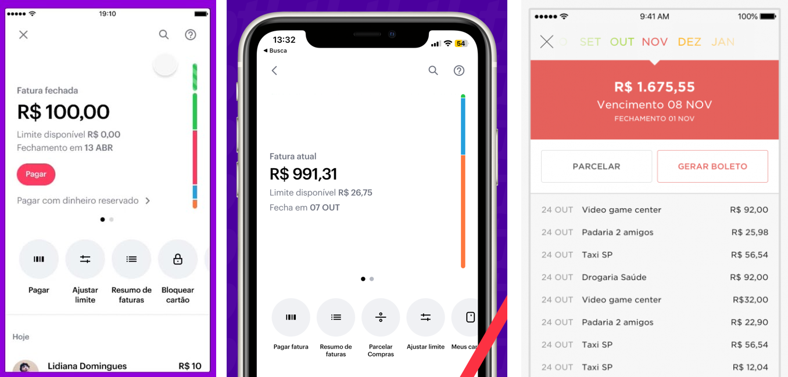

# Go Account Fee

This is a personal project to practice what I've learned about Golang so far (and learn a lot more). The goal is to implement some enterprise-like features in a fictional digital bank context in a way that I will be able to:
- have a taste of what is like working with Go on a real-life project;
- build common components of modern cloud systems, like microservices and serverless functions;
- explore the benefits and limitations of working with Golang and its tooling.

## Context

Over the last decade, it has been seen a boom of digital banks popping up in Brazil (for the record, I currently work in one of them). Like most Brazilians, my first experience with these banks was being a customer of Nubank, the most popular of the sort in Latin America, which has arguably the best app UI/UX, being miles ahead of its competitors even today. One of the things that I liked about this app is that the credit card invoice is updated almost in real-time, regardless if you are using it in some local establishment or paying some amount of the invoice with the digital account balance. In contrast, most of the other banks (especially the ones that were there before the digital era) take from 1 to 2 days to make this kind of update; some of them don't even show which transactions are pending, in a way that they just pop up on the invoice next day. 

I think that this behavior results from all the complicated steps to finish a credit card transaction, in a way that the invoice is only updated when everything is finished (maybe there is even a regulation that says that should be like that). I know that the born-digital ones usually are built over some off-the-shelf core banking system, which, in turn, has these daily batch processes to settle transactions, with the invoices being updated afterward. So, I don't know what Nubank does, but I think that if one of those digital banks wanted to reproduce this behavior, it would probably assume, for the current day, an approved transaction as settled, in the sense that they can be updated it right away in the invoice view for the user. This way, the transaction would be settled later on the batch processing and included in the real invoice, which, in turn, would replace the temporary view for the user and, on the happy path, this change of views won't be noticed and the user will feel like the invoice is updated immediately. Of course, it must have some (or a lot) of pitfalls in this approach, but I think that it can be an interesting challenge for a practice project with the goals that I listed before, so that's exactly I will be trying to do here.

In resume, the challenge is to develop a credit card invoice system that seems to provide immediately updated info to the user in the scenario that this development is done in a new-born digital bank which is built over some off-the-shelf core banking system.

## Business

Lorem ipsum.

## Architecture


## Front-End Contract

The contract should provide data to fill info on these screens:



For the current invoice info:

Endpoint
```
GET {host}/invoices/current?customerId={customerId}
```

Response Body
```json
{
    "id": "abc-123-def",
    "statusLabel": "Closed|Current",
    "amount": 1234.56,
    "closingDate": "APR 13"
}
```

For the invoice summary info:

Endpoint
```
GET {host}/invoices/summary/{invoiceId}
```

Response Body
```json
{
    "id": "abc-123-def",
    "refMonthLabel": "NOV",
    "amount": 1675.55,
    "dueDate": "NOV 8",
    "closingDate": "NOV 1",
    "entries": [
        {
            "date": "OCT 24",
            "description": "Taxi SP",
            "amount": 56.54
        },
        {
            "date": "OCT 27",
            "description": "Amazon 3/6",
            "amount": 111.11
        }
    ]
}
```


## Core Banking Contract

For the invoices info:

Endpoint
```
GET {host}/invoices?creditAccountId={creditAccountId}
```

Response Body
```json
{
    "creditAccountId": 123,
    "processingSituation": "CLOSED|OPEN|FUTURE",
    "isPaymentDone": true,
    "dueDate": "2023-08-15",
    "actualDueDate": "2023-08-15",
    "closingDate": "2023-08-05",
    "totalAmount": 1234.56,
    "invoiceId": 1234
}
```

For the invoices entries info:

Endpoint
```
GET {host}/invoices/:invoiceId?customerId=:customerId
```

Response
```json
{
    "customerId": 123,
    "invoiceId": 1234,
    "processingSituation": "CLOSED|OPEN|FUTURE",
    "amount": 1234.56,
    "closingDate": "2023-08-05",
    "dueDate": "2023-08-15",
    "actualDueDate": "2023-08-15",
    "isPaymentDone": true,
    "entries": [
        {
            "transactionId": 12345,
            "amount": 22.01,
            "installmentNumber": 2,
            "numInstallments": 3,
            "transactionDateTime": "2023-05-31T09:54:30",
            "merchantDescription": "DFV Digital"
        }
    ]
}
```

For the purchases events:

Event
```json
{
    "transactionId": 12345,
    "customerId": 123,
    "transactionDateTime": "2023-05-31T09:54:30",
    "totalAmount": 66.03,
    "numInstallments": 3,
    "merchantDescription": "DFV Digital",
    "status": "PENDING|CLEARED|PROCESSED|CANCELED"
}
```